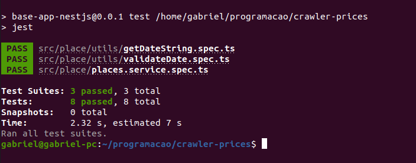

# Crawler Places
The project allows you to request vacancies on a given website.

## Technologies
- Typescript with NestJS.
- Test of integration and unit with Jest.

## Starting
To run the project, you will need to install the following programs

- [Docker](https://docs.docker.com/get-docker/)

## Development

Clone the repository for your machine.

```shell
git clone https://github.com/gabrielmussolini984/crawler-hotels-price.git
```

### Construct

To run the project with the docker-compose:

```shell
docker-compose up
```

The command will upload all the services necessary for the application to work.

### Testing API
[POST] http://localhost:3000/place
- Get rooms with name, description images and price.
``` JSON
{
	"checkIn": "2020-03-03",
	"checkOut": "2020-03-04"
}
```
### Run tests
- Run `docker exec -it crawler-app cd /home/node/app/ && npm test`
## Features
In this project you can search for information about places to stay by entering the checkin and checkout date.

### Insomnia Places

### Insomnia Error 1


### Insomnia Error 2

### Insomnia Error 3

### Page: API Documentation

### Tests

#### Thanks!